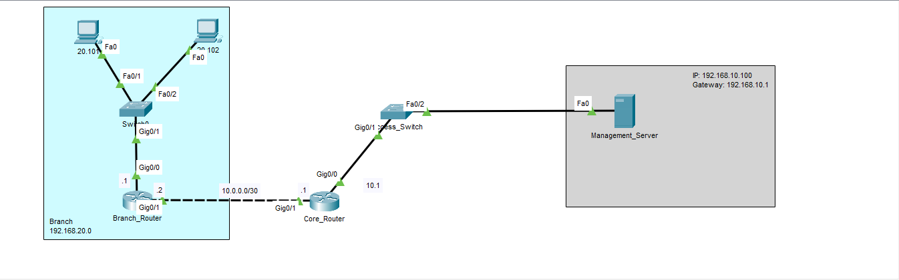

# Centralized Network Monitoring & Security Hardening (Cisco Packet Tracer)

This project demonstrates the implementation of a centralized monitoring system for a multi-site network infrastructure using **Syslog** and **SNMP** protocols. It focuses on network visibility, event logging, and security best practices on Cisco IOS devices.

## 🚀 Key Features
* **Centralized Logging (Syslog):** All critical network events (port status, config changes, security alerts) are forwarded to a central server.
* **Network Health Monitoring (SNMP v2c):** Device inventory and system descriptions are queryable via MIB Browser.
* **Precise Event Tracking:** Enabled millisecond-precision timestamps for all logs to ensure accurate forensic analysis.
* **Security Hardening:** Configured SSH access, encrypted enable secrets, and login failure logging to detect unauthorized access attempts.
* **Static Routing:** Established full connectivity between Central and Branch offices.

## 🛠️ Topology Information
* **Core_Router (Headquarters):** `192.168.10.1`
* **Branch_Router (Remote Site):** `10.0.0.2`
* **Management_Server:** `192.168.10.100` (Hosting Syslog and SNMP services)

## 📋 Configuration Highlights
### Syslog Setup
- Enabled logging to remote server: `logging 192.168.10.100`
- Enabled timestamps: `service timestamps log datetime msec`

### SNMP Setup
- Configured Read-Only community string: `snmp-server community [Your_Community_String] RO`

### Security
- Disabled insecure Telnet, enabled SSH.
- Configured login logging: `login on-failure log` / `login on-success log`

## 📂 Project Structure
* `Network_Monitoring_Lab.pkt`: The main Cisco Packet Tracer lab file.
* `/screenshots`: Visual evidence of Syslog messages and SNMP query results.

## 💡 How to Use
1. Download and open the `.pkt` file in Cisco Packet Tracer.
2. Navigate to the **Management_Server** -> **Desktop** -> **Syslog** to see real-time logs.
3. Use the **MIB Browser** on the server to query the routers using the configured community string.
